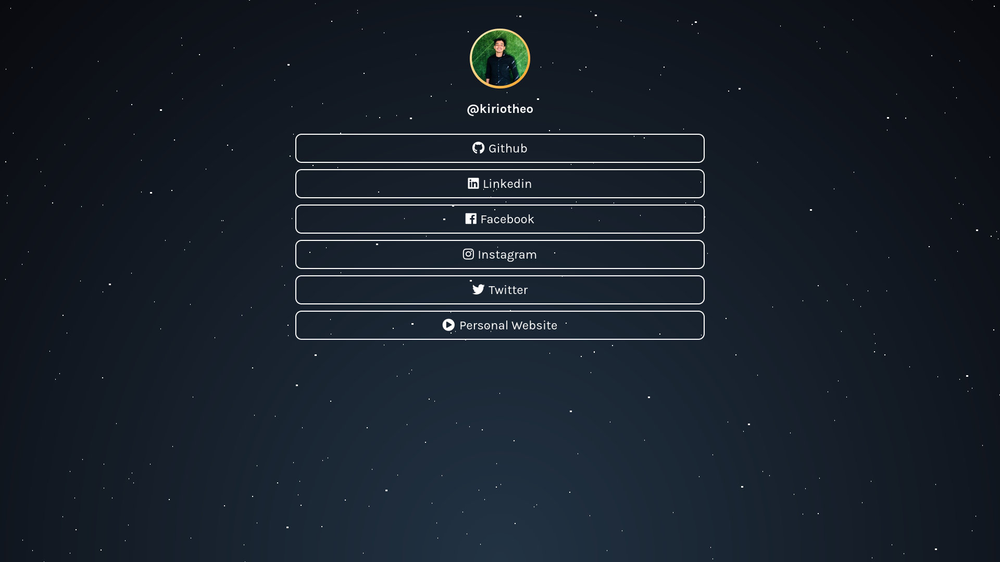

<h1 align="center">🌲 Linktree</h1>
<h2> A linktree altenative for developer who don't want to get linktree watermark on their website.</h2>

<h3 align="center">Simple site to group all my profiles on social networks in one place.</h3>

<p align="center">
  <a href="#-about-the-project">About the project</a>&nbsp;&nbsp;&nbsp;|&nbsp;&nbsp;&nbsp;
  <a href="#-getting-started">Getting started</a>&nbsp;&nbsp;&nbsp;|&nbsp;&nbsp;&nbsp;
  <a href="#-how-to-contribute">How to contribute</a>&nbsp;&nbsp;&nbsp;|&nbsp;&nbsp;&nbsp;
  <a href="#-license">License</a>
</p>

---

<p align="center">
  
</p>

---

## 💡 About the project

This is an open source project that serves as a free alternative to the Linktree website.
- [Demo](https://kiriotheo.github.io/linktree)

## 🚀 Getting started

If you installed git you can clone the code to your machine, or download a ZIP of all the files directly.
[Download the ZIP from this location](https://github.com/kiriotheo/linktree/archive/master.zip), or run the following [git](https://git-scm.com/downloads) command to clone the files to your machine:
```bash
git clone https://github.com/kiriotheo/linktree
```
- Once the files are on your machine, open the _linktree_ folder in [Visual Studio Code](https://code.visualstudio.com/).
- With the files open in Visual Studio Code, press the **Go Live** button at the bottom of the window to launch the files with [Live Server](https://marketplace.visualstudio.com/items?itemName=ritwickdey.LiveServer).
- Change the profile image and texts in the `index.html` file.
- Change the colors and fonts in the `style.css` file.
- To change the background, go to the `style.css` file on line 17, uncomment the code snippet and change the url to whatever image you want.

## 👓 Step to make your own linktree web page:
- fork this repository and boom you wil get this repository in your profile section.
- Edit HTML to add your link to show-case on that web page.
- Go to  settings of the repository and publish github page.
- Boom! Your own free Linktree like page is ready now you can acess this through world-wide by given github-url.
- Don't Forgot to star this repository.

## 🤔 How to contribute

- Fork this repository;
- Create a branch with your feature: `git checkout -b my-feature`;
- Commit your changes: `git commit -m "feat: my new feature"`;
- Push to your branch: `git push origin my-feature`.

Once your pull request has been merged, you can delete your branch.

## 📝 License

This project is under the MIT license. See the [LICENSE](LICENSE.md) file for more details.

---

Made with ❤️ by Aditya Vijay :wave: [Get in touch](https://kiriotheo.github.io/linktree)

